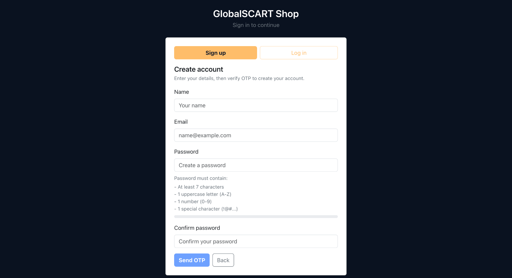
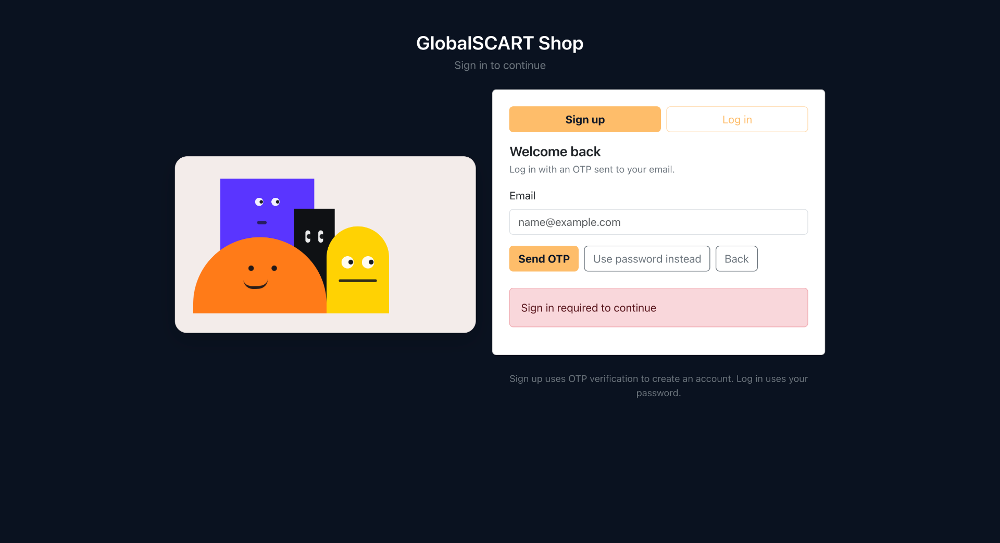
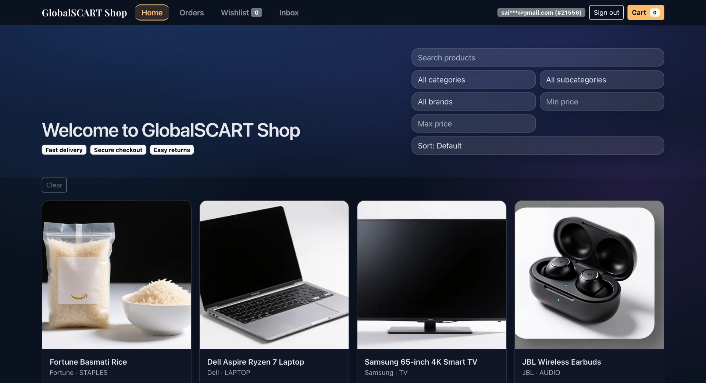
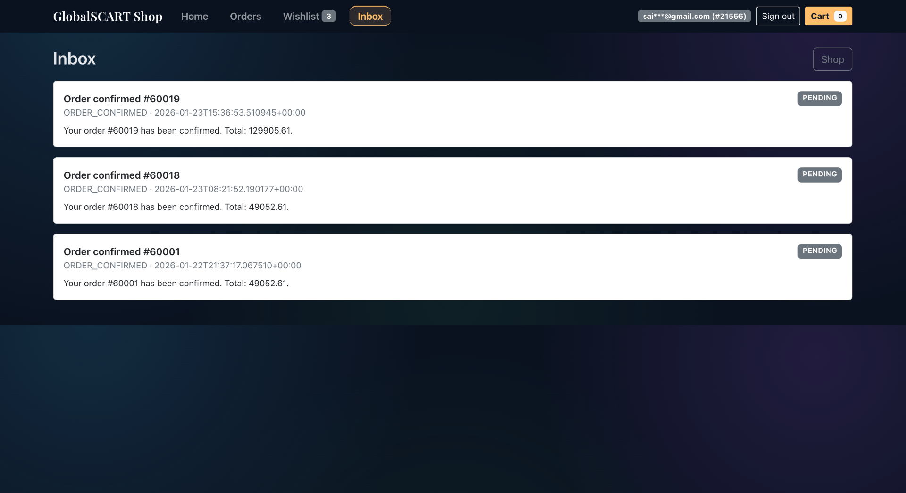
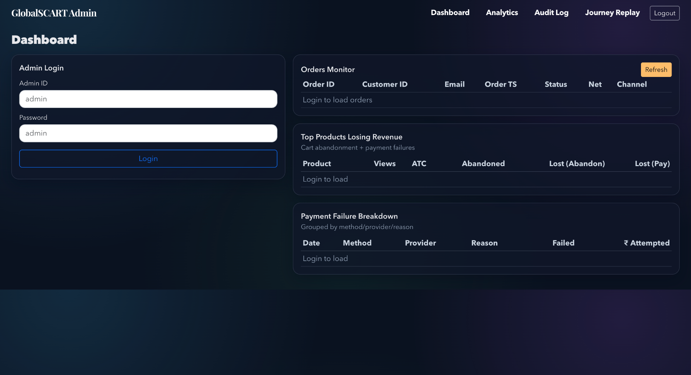

# GlobalCart 360: Backend Commerce & Analytics Engine

[](https://globalscart.onrender.com/shop/)
[](https://globalscart.onrender.com/admin/)
[](https://globalscart.onrender.com/docs)


## 🔥 Why This Project Matters
- **Transactional Integrity**: Engineered a multi-stage checkout lifecycle (`ORDER_CREATED → PAYMENT_PENDING → SUCCESS/FAIL`) using PostgreSQL transactions for atomic consistency.
- **Production-Style Backend**: Implemented FastAPI with structured middleware, Request ID tracing, and centralized configuration.
- **Data Engineering**: Built a near real-time analytics pipeline with star-schema processing, idempotent upserts, and incremental refresh logic.
- **Security & RBAC**: Developed JWT-secured API flows with Role-Based Access Control and OTP-based verification.
- **Containerization**: Fully containerized environment using Docker Compose for reproducible deployment.

## 📸 System Preview (High-Impact UI)

<p align="center">
  
</p>

### 🛠️ Backend Observability & Admin Analytics
<p align="center">
  
  
</p>

## 🚀 Live Links
- **🛒 [Storefront (Customer Flow)](https://globalscart.onrender.com/shop/)**
- **📊 [Admin Analytics Dashboard](https://globalscart.onrender.com/admin/)**
- **📜 [Swagger API Documentation](https://globalscart.onrender.com/docs)**

## ⚡ Quick Start (Local Demo)
```bash
# 1. Clone & Setup
git clone https://github.com/girishk03/GlobalScart.git
cd GlobalScart

# 2. Start Database
docker-compose up -d

# 3. Run Pipeline (Generate & Load Data)
python -m src.pipeline --scale small --truncate

# 4. Start Backend
uvicorn backend.main:app --host 0.0.0.0 --port 8000 --reload
```
*Access Shop at `http://localhost:8000/shop/` | Admin at `http://localhost:8000/admin/`*

## 🛠️ Engineering Decisions (Tradeoffs & Solutions)

| Challenge | Solution | Engineering Impact |
| :--- | :--- | :--- |
| **Inventory Overselling** | Row-level locking + `reserved_qty` | Prevents race conditions during high-concurrency checkouts. |
| **Idempotency** | Webhook idempotency table | Ensures payment processing is safe against network retries. |
| **Observability** | Request-ID middleware | Allows end-to-end tracing of API calls across logs. |
| **Data Scalability** | Incremental Star Schema | Enables performant analytics on millions of rows without full reloads. |

---

## 🏗️ Technical Architecture Details

<details>
<summary><b>View System Design & Implementation Deep Dive</b></summary>

### 🛒 Transactional Storefront
- **Atomic Order Creation**: Handled via `POST /api/customer/checkout/start` within a single DB transaction.
- **State Machine**: `ORDER_CREATED → PAYMENT_PENDING → {PAYMENT_SUCCESS → ORDER_CONFIRMED} | {PAYMENT_FAILED → ORDER_CANCELLED}`.
- **Inventory Locking**: Row-level locking to prevent overselling during high-concurrency checkouts.

### 📊 Data Engineering & Analytics
- **Star Schema**: Optimized PostgreSQL schema for analytical queries.
- **Incremental Refresh**: Efficient data updates using `updated_at` watermarks and staging tables.
- **BI Marts**: Materialized views for executive KPIs and performance trends.

**Evidence**:
- API reference (repo): `docs/api.md`
- UI flow (repo): `docs/ui.md`
- Security notes (repo): `docs/security.md`
- Transaction lifecycle code: `backend/routes/api_customer.py`
- Lifecycle tests: `tests/test_checkout_lifecycle.py`

**Scope note:** This repository is a resume-ready **analytics + transactional demo** with a clear lifecycle and realistic architecture patterns. It is not a production store (missing PCI compliance, etc.).

For the “mixed concerns” story (analytics + APIs + UI + BI assets), see: `docs/architecture.md`.

</details>

<details>
<summary><b>View API Reference & Examples (CURL)</b></summary>

### Auth (JWT)
1) Get a JWT token:
```bash
curl -X POST http://localhost:8000/api/auth/token \
  -H "Content-Type: application/json" \
  -d '{"email":"you@example.com","password":"YourPassword"}'
```

### Create an order
```bash
curl -X POST http://localhost:8000/api/customer/checkout/start \
  -H "Content-Type: application/json" \
  -H "Authorization: Bearer <token>" \
  -d '{
    "items": [{"product_id": 1001, "qty": 2}],
    "channel": "WEB",
    "currency": "INR",
    "payment_method": "UPI"
  }'
```
</details>

<details>
<summary><b>View Step-by-Step Installation & Full Gallery</b></summary>

### Customer Storefront
**Welcome / Landing**


**Sign Up (OTP-based)**


**Log In**


**Shop Home — Product Catalog & Filters**


**Wishlist**


**Cart**


**Checkout — Delivery & Payment**


**Order History**


**Inbox / Notifications**


### Admin Dashboard
**Admin Login**


**Analytics — Revenue, Funnel & Top Products**


**Audit Log — Order State Changes**


**User Journey Replay**


**Journey Replay - Timeline Detail**


</details>

## 🛠️ Tech Stack & Implementation Details
- **SQL**: PostgreSQL (Star Schema, Transactional Store)
- **Python**: FastAPI, Pydantic, SQLAlchemy, Pandas
- **Auth**: JWT + OTP-based Role-Based Access Control (RBAC)
- **Observability**: Structured Logging, Request ID Tracing, Security Middleware
- **Deployment**: Docker, Docker Compose

<details>
<summary><b>View Full Repository Structure</b></summary>

- `sql/`: Star schema DDL, views, KPI queries, BI marts.
- `backend/`: FastAPI server, routes, security modules.
- `src/`: Data generator, loaders, analytics pipeline.
- `docs/`: Architecture diagrams, API spec, security notes.
</details>
