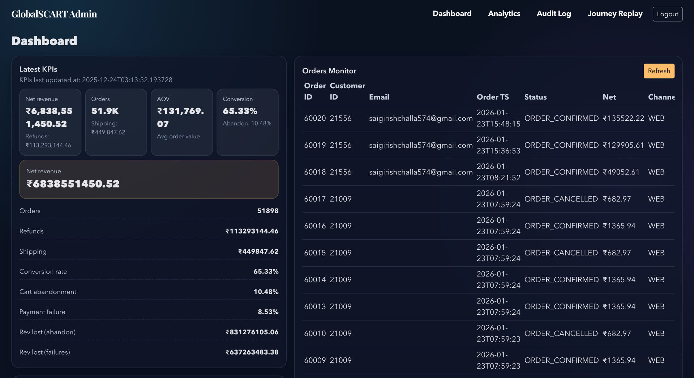
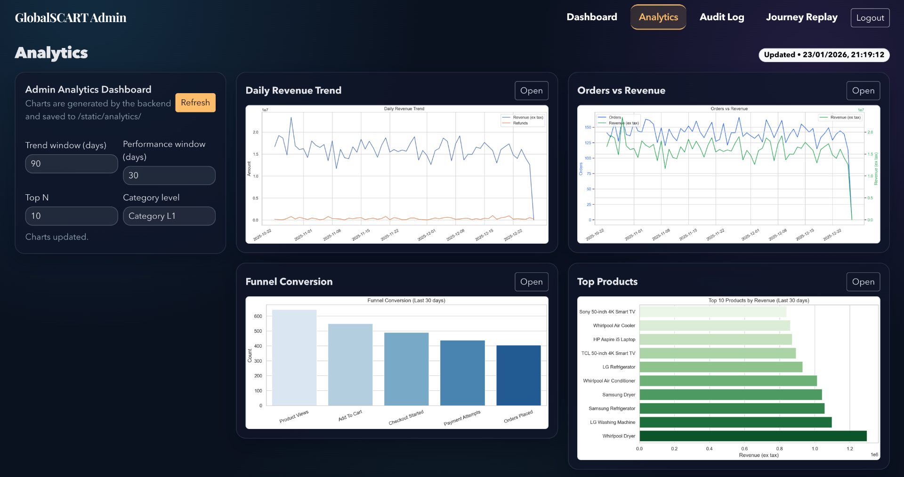
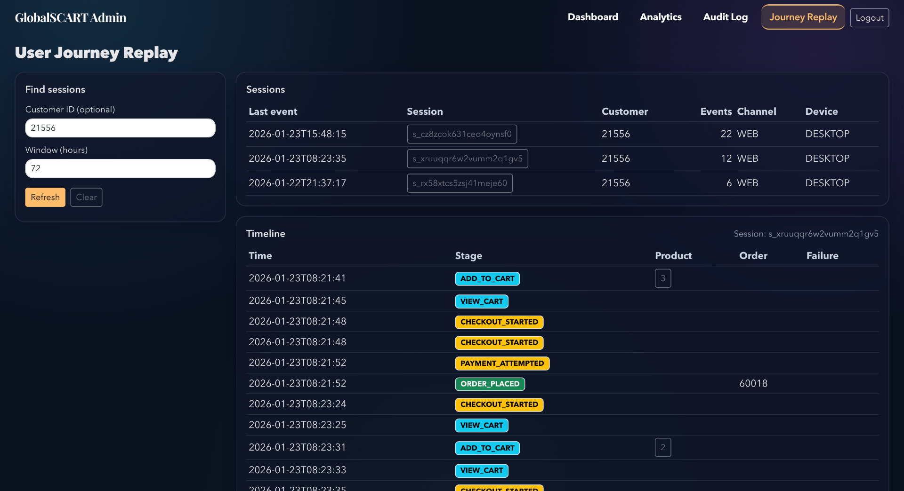

# GlobalCart 360: Backend Commerce & Analytics Engine


## 🔥 Why This Project Matters
- **Transactional Integrity**: Engineered a multi-stage checkout lifecycle (`ORDER_CREATED → PAYMENT_PENDING → SUCCESS/FAIL`) using PostgreSQL transactions for atomic consistency.
- **Production-Style Backend**: Implemented FastAPI with structured middleware, Request ID tracing, and centralized configuration.
- **Data Engineering**: Built a near real-time analytics pipeline with star-schema processing, idempotent upserts, and incremental refresh logic.
- **Security & RBAC**: Developed JWT-secured API flows with Role-Based Access Control and OTP-based verification.
- **Containerization**: Fully containerized environment using Docker Compose for reproducible deployment.

## 📸 System Preview (High-Impact UI)

<p align="center">
  
</p>

### 🛠️ Backend Observability & Admin Analytics
<p align="center">
  
  
</p>

## ⚡ Quick Start (Local Demo)
```bash
# 1. Clone & Setup
git clone https://github.com/girishk03/GlobalScart.git
cd GlobalScart

# 2. Start Database
docker-compose up -d

# 3. Run Pipeline (Generate & Load Data)
python -m src.pipeline --scale small --truncate

# 4. Start Backend
uvicorn backend.main:app --host 0.0.0.0 --port 8000 --reload
```
*Access Shop at `http://localhost:8000/shop/` | Admin at `http://localhost:8000/admin/`*

## 🛠️ Engineering Decisions (Tradeoffs & Solutions)

| Challenge | Solution | Engineering Impact |
| :--- | :--- | :--- |
| **Inventory Overselling** | Row-level locking + `reserved_qty` | Prevents race conditions during high-concurrency checkouts. |
| **Idempotency** | Webhook idempotency table | Ensures payment processing is safe against network retries. |
| **Observability** | Request-ID middleware | Allows end-to-end tracing of API calls across logs. |
| **Data Scalability** | Incremental Star Schema | Enables performant analytics on millions of rows without full reloads. |

---

## 🏗️ Technical Architecture Details
<details>
<summary><b>View System Design & Implementation Deep Dive</b></summary>

### 🛒 Transactional Storefront
...
### 📊 Data Engineering & Analytics
...
**Evidence**:
...
</details>

<details>
<summary><b>View API Reference & Examples (CURL)</b></summary>
...
</details>

<details>
<summary><b>View Step-by-Step Installation & Local Demo</b></summary>
...
</details>

### Customer Storefront
...
</details>

## 🛠️ Tech Stack & Implementation Details
- **SQL**: PostgreSQL (Star Schema, Transactional Store)
- **Python**: FastAPI, Pydantic, SQLAlchemy, Pandas
- **Auth**: JWT + OTP-based Role-Based Access Control (RBAC)
- **Observability**: Structured Logging, Request ID Tracing, Security Middleware
- **Deployment**: Docker, Docker Compose

<details>
<summary><b>View Full Repository Structure</b></summary>

- `sql/`: Star schema DDL, views, KPI queries, BI marts.
- `backend/`: FastAPI server, routes, security modules.
- `src/`: Data generator, loaders, analytics pipeline.
- `docs/`: Architecture diagrams, API spec, security notes.
</details>

<details>
<summary><b>View Step-by-Step Installation</b></summary>
