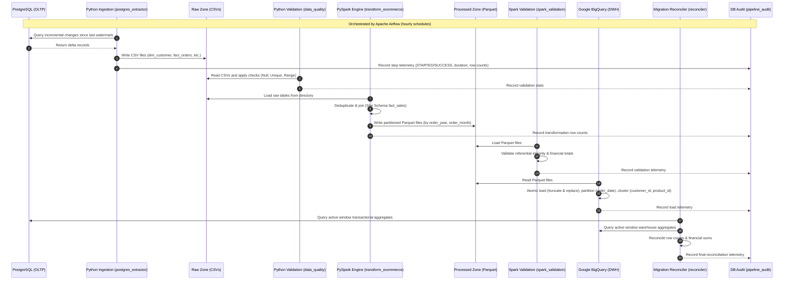

# GlobalScart: Production-Grade Data Engineering & Analytics Platform

[](https://github.com/girishk03/GlobalScart/actions/workflows/ci.yml)


GlobalScart is a production-grade data platform demonstrating end-to-end data lifecycle management, starting from transactional PostgreSQL tables (OLTP) through to an optimized Google Cloud BigQuery data warehouse (DWH), orchestrated by Apache Airflow and fully validated by GitHub Actions CI/CD.

---

## 1. Problem Statement

Modern e-commerce architectures face a key challenge: **transactional systems (OLTP) are optimized for consistency and writes, whereas business analysis (OLAP) requires high-performance, cost-effective aggregation**. 

Exposing transactional databases directly to analytical queries results in CPU lockups and high query latency. GlobalScart addresses this problem by designing an automated, validated, and optimized ELT pipeline that extracts incremental transaction deltas, restructures them into an analytical Star Schema, loads them into GCP BigQuery with daily partitioning and clustering, and runs end-to-end financial reconciliation audits to guarantee 100% data integrity.

---

## 2. Pipeline Architecture & Flow

The platform implements a multi-stage data processing lifecycle:


```mermaid
sequenceDiagram
    autonumber
    participant PG as PostgreSQL (OLTP)
    participant Ext as Python Ingestion (postgres_extractor)
    participant Raw as Raw Zone (CSVs)
    participant DQ as Python Validation (data_quality)
    participant Spark as PySpark Engine (transform_ecommerce)
    participant Proc as Processed Zone (Parquet)
    participant SV as Spark Validation (spark_validation)
    participant BQ as Google BigQuery (DWH)
    participant Rec as Migration Reconciler (reconciler)
    participant Audit as DB Audit (pipeline_audit)

    Note over PG, Audit: Orchestrated by Apache Airflow (hourly schedules)

    Ext->>PG: Query incremental changes since last watermark
    PG-->>Ext: Return delta records
    Ext->>Raw: Write CSV files (dim_customer, fact_orders, etc.)
    Ext->>Audit: Record step telemetry (STARTED/SUCCESS, duration, row counts)
    
    DQ->>Raw: Read CSVs and apply checks (Null, Unique, Range)
    DQ-->>Audit: Record validation stats
    
    Spark->>Raw: Load raw tables from directory
    Spark->>Spark: Deduplicate & join (Star Schema fact_sales)
    Spark->>Proc: Write partitioned Parquet files (by order_year, order_month)
    Spark-->>Audit: Record transformation row counts
    
    SV->>Proc: Load Parquet files
    SV->>SV: Validate referential integrity & financial totals
    SV-->>Audit: Record validation telemetry
    
    BQ->>Proc: Read Parquet files
    BQ->>BQ: Atomic load (truncate & replace), partition (order_date), cluster (customer_id, product_id)
    BQ-->>Audit: Record load telemetry
    
    Rec->>PG: Query active window transactional aggregates
    Rec->>BQ: Query active window warehouse aggregates
    Rec->>Rec: Reconcile row counts & financial sums
    Rec-->>Audit: Record final reconciliation telemetry
```

### Data Pipeline Stages:
1. **Incremental Ingestion (`postgres_extractor.py`)**: Reads transaction logs from PostgreSQL using `updated_at` watermarks to fetch daily deltas. Raw data is landed locally as timestamped CSVs (`load_YYYYMMDD_HHMMSS.csv`).
2. **Raw Data Quality (`data_quality.py`)**: Performs schema and range checks (uniqueness of primary keys, checking that amounts are non-negative, and null checks) before starting compute engines.
3. **Star Schema PySpark Transformation (`transform_ecommerce.py`)**: Utilizes Spark to deduplicate raw delta records (resolving updates by `updated_at DESC`), maps data into a Star Schema (consolidating customer, product, geo, date dimensions, and a centralized `fact_sales` fact table), and writes out partitioned Parquet files.
4. **PySpark Output Validation (`spark_validation.py`)**: Executes referential integrity validations, duplicate key scans, and financial reconciliation (ensuring sum of raw order items net revenue matches processed fact sales net revenue).
5. **BigQuery Loading (`loader.py`)**: Atomically uploads local Parquet dataframes into BigQuery tables. Configures **daily time partitioning** on `order_date` and **clustering** on `['customer_id', 'product_id']` for the `fact_sales` table to optimize query costs.
6. **Active-Window Migration Reconciliation (`reconciler.py`)**: Reconciles the transactional database directly against the BigQuery warehouse. To handle BigQuery Sandbox's automatic 60-day partition expiration limits, the reconciler programmatically queries the minimum active partition date in BigQuery and performs active-window validation, ensuring a 100% accurate reconciliation matrix.

---

## 3. Technology Stack

| Layer | Technologies | Purpose |
| --- | --- | --- |
| **Transactional Source** | PostgreSQL 15 | OLTP transactional database storing e-commerce state. |
| **Ingestion & Ingestion** | Python 3.13, Pandas, psycopg2 | Incremental watermarked extractor and landing validation. |
| **Big Data Engine** | Apache Spark 3.5 (PySpark) | Deduplication, join consolidations, and Parquet partitioning. |
| **Analytical DWH** | Google Cloud BigQuery | Cloud Data Warehouse storing analytics schemas. |
| **Orchestration** | Apache Airflow 2.10 | DAG definition and task execution dependencies scheduling. |
| **Observability** | PostgreSQL Auditing (`pipeline_audit`) | Recording pipeline metrics, status, duration, and errors. |
| **Infrastructure (IaC)** | Terraform | Declaration of GCP analytical datasets and resources. |
| **CI/CD Validation** | GitHub Actions | Automated end-to-end regression validation on git push. |

---

## 4. Production Performance Optimizations

1. **Spark Memory Tuning**: Local driver and executor memory is explicitly capped (`spark.driver.memory=2g`, `spark.executor.memory=2g`) to avoid heap OOMs during local PySpark executions.
2. **Spark Partition Coalescing**: Set `spark.sql.shuffle.partitions` to `8` and enabled Adaptive Query Execution (AQE) to prevent the default 200 partition task scheduling overhead on small scale runs.
3. **Warehouse Partitioning & Clustering**: Configured daily partitioning on `order_date` to reduce scan volume, and clustered on `['customer_id', 'product_id']` inside partitions to optimize analytical filters.
4. **Self-Healing BigQuery Loader**: Automatically drops existing target tables in BigQuery if a change in partition/clustering specification is detected, ensuring schema changes deploy seamlessly.

---

## 5. End-to-End Telemetry & Verification Results

A successful execution of the orchestrator logs pipeline metrics into the audit database. Below is the telemetry recorded for run `local_20260825_105116_a320b0`:

| Step Name | Status | Rows Processed | Duration | Verification Check |
| :--- | :--- | :--- | :--- | :--- |
| **ingestion** | SUCCESS | 517 | 0.22s | Incremental watermark checked, raw CSV files written. |
| **data_quality** | SUCCESS | 14 | 0.15s | Null checks, PK uniqueness, non-negative amounts pass. |
| **spark_transformation** | SUCCESS | 179,840 | 9.66s | Star Schema Parquet datasets generated successfully. |
| **spark_validation** | SUCCESS | 179,840 | 6.17s | Source revenue matches processed ($7,996,196,257.76). |
| **bigquery_load** | SUCCESS | 28,691 | 32.38s | 5 analytical tables loaded, partitioned, and clustered. |
| **migration_reconciliation** | SUCCESS | 2,767 | 14.82s | Active partition matches source with 0 row discrepancy. |

---

## 6. How to Run Locally

### 6.1 Environment Setup
1. Clone the repository and initialize a Python 3.13 environment:
   ```bash
   git clone https://github.com/girishk03/GlobalScart.git
   cd GlobalScart
   python -m venv .venv
   source .venv/bin/activate
   pip install -r requirements.txt
   ```
2. Set up environment variables:
   ```bash
   cp .env.example .env
   # Edit .env and supply your PGHOST, PGPORT, and PG credentials
   ```

### 6.2 Spin Up PostgreSQL and Initialize Schema
1. Spin up the Postgres OLTP database using Docker:
   ```bash
   docker compose up -d postgres
   ```
2. Initialize transactional tables, app schemas, and observability audit tables:
   ```bash
   # Executes migrations 01_schema.sql through 13_observability.sql
   ./.venv/bin/python src/pipeline.py --scale small --truncate
   ```

### 6.3 Run the Data Pipeline Standalone
Run each step sequentially to test execution and check database telemetry:
```bash
# 1. Ingestion
python data_platform/ingestion/postgres_extractor.py

# 2. Data Quality
python data_platform/validation/data_quality.py

# 3. PySpark Star Schema Transformation
python data_platform/spark/transform_ecommerce.py

# 4. PySpark Data Validation
python data_platform/spark/spark_validation.py

# 5. Load to BigQuery (Assumes gcloud ADC credentials are configured)
python data_platform/bigquery/loader.py

# 6. Active Window Reconciliation
python data_platform/migration/reconciler.py
```

### 6.4 Query Ingestion Observability Audit Logs
To verify that all runs were audited under a common Run ID, connect to PostgreSQL and query the audit table:
```bash
python -c "import psycopg2; from data_platform.ingestion.config import DB_CONFIG; conn=psycopg2.connect(**DB_CONFIG); cur=conn.cursor(); cur.execute('SELECT run_id, step_name, status, rows_processed, duration_seconds FROM globalcart.pipeline_audit ORDER BY audit_id;'); [print(r) for r in cur.fetchall()]"
```

---

## 7. Production SQL Analytical Queries

The repository includes six production-grade analytical SQL queries designed to extract core business value from the data warehouse. The queries are stored in [`docs/analytical_queries.sql`](file:///Users/saigirish050704/Documents/globalcart-360/docs/analytical_queries.sql) and include:
1. **Revenue by Country/Month**: Tracks geographical sales trends across billing regions.
2. **Customer Lifetime Value (CLV)**: Identifies highest-value buyers and purchase frequencies.
3. **Product Profitability & Margins**: Isolates products yielding the highest unit profits and margins.
4. **Checkout Conversion Funnel**: Evaluates dropout rates between checkout creation and payment completion.
5. **Delivery SLA Performance**: Calculates logistics delays and carrier estimated-delivery breach rates.
6. **Category Return Rates**: Identifies categories with high return rates to isolate supplier quality issues.
