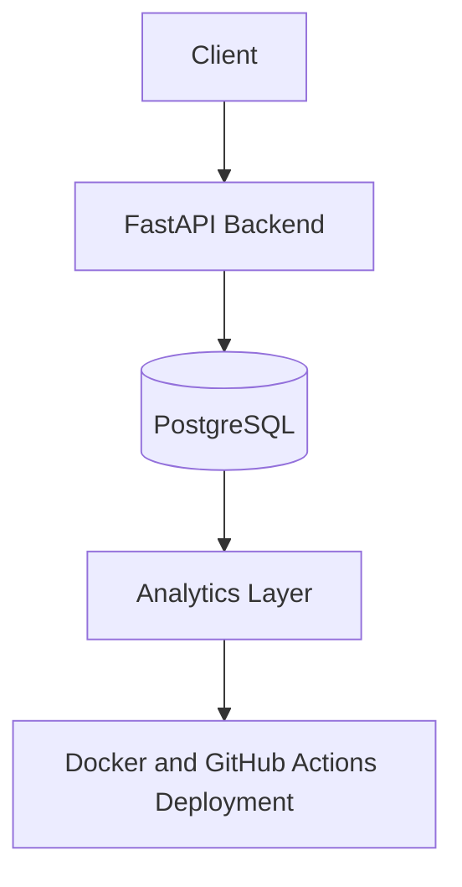
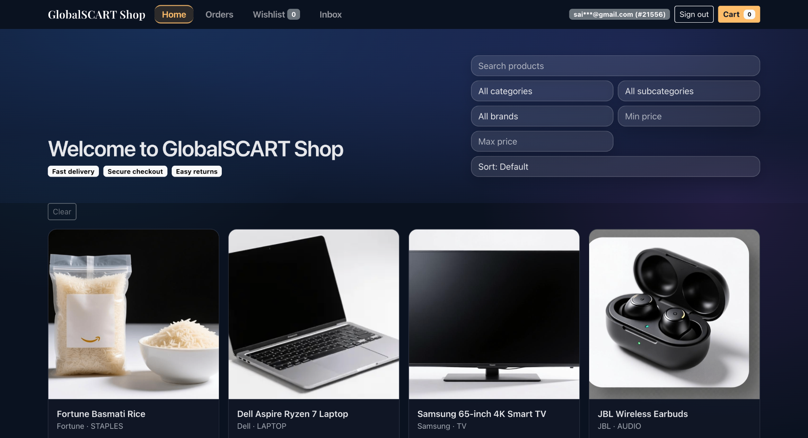
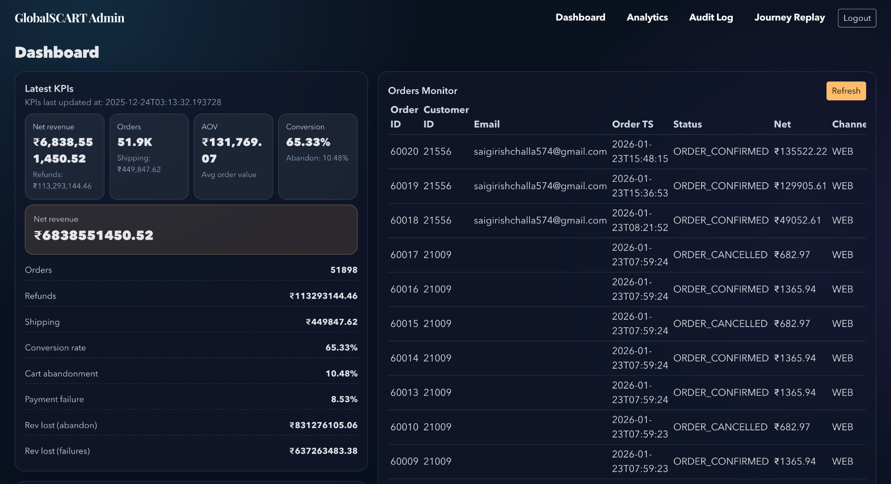
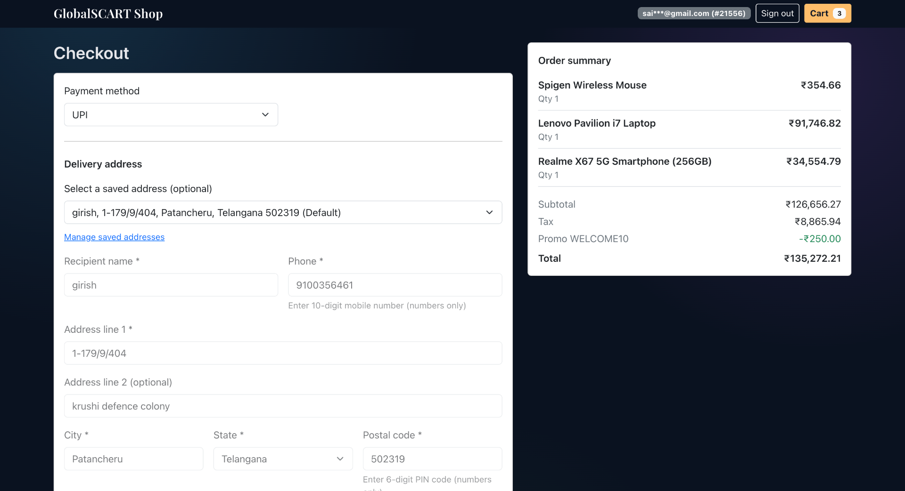
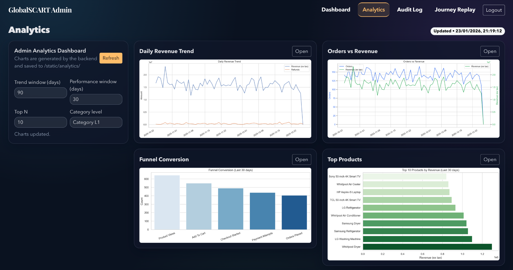

# GlobalScart 360

[](https://github.com/girishk03/GlobalScart/actions/workflows/ci.yml)


GlobalScart 360 is a Python backend and analytics project that models an e-commerce platform end to end: customer authentication, catalog and cart operations, transactional checkout, inventory reservation, payment processing, order lifecycle management, and analytical reporting.

[Live Shop](https://globalscart.onrender.com/shop/) · [Admin Dashboard](https://globalscart.onrender.com/admin/) · [Swagger UI](https://globalscart.onrender.com/docs)

## Quick Start

```bash
git clone https://github.com/girishk03/GlobalScart.git
cd GlobalScart
python3.11 -m venv .venv
source .venv/bin/activate
pip install -r requirements.txt
cp .env.example .env
docker compose up -d postgres
python -m src.pipeline --scale small --truncate
python -m uvicorn backend.main:app --host 0.0.0.0 --port 8000 --reload
```

Open `http://localhost:8000/docs` for the interactive API documentation. See [Setup Guide](#setup-guide) for database initialization and environment details.

## Project Overview

The repository combines a FastAPI application, PostgreSQL transactional and analytical schemas, a browser-based storefront and admin interface, Python data pipelines, SQL reporting marts, Docker packaging, and automated tests. It is designed as a portfolio implementation of backend engineering patterns rather than a production payment platform.

## Problem Statement

Commerce systems must keep customer, inventory, order, and payment state consistent while also exposing trustworthy data for operational and business reporting. GlobalScart 360 demonstrates how those concerns can be handled in one reproducible project, with explicit transaction boundaries, authenticated access, idempotent payment events, and an analytics layer built from the same PostgreSQL source.

## Key Features

- Email OTP signup, password login, JWT access tokens, and role-based authorization.
- Product catalog, product detail, ratings, reviews, wishlist, cart, promotions, addresses, and customer inbox APIs.
- Transactional checkout with inventory reservation and order/payment state transitions.
- Razorpay order creation, signature verification, and idempotent webhook ingestion.
- Customer order detail, timeline, cancellation, and payment simulation flows.
- Admin KPIs, audit logs, user journey replay, finance views, funnel analysis, and BI mart exports.
- Request ID tracing, consistent JSON error responses, security headers, CORS, and demo-grade rate limiting.
- SQL views, materialized BI marts, incremental refresh utilities, segmentation, forecasting, and report generation.

## Tech Stack

| Layer | Technologies |
| --- | --- |
| Backend | Python 3.11, FastAPI, Uvicorn, Pydantic |
| Database | PostgreSQL, psycopg, SQLAlchemy |
| Authentication | PyJWT, HS256 JWTs, email OTP, password hashing, RBAC |
| Payments | Razorpay sandbox integration, HMAC signature verification, webhook idempotency |
| Analytics | Pandas, NumPy, scikit-learn, statsmodels, Matplotlib, Seaborn |
| Frontend | HTML, CSS, JavaScript served by FastAPI static mounts |
| Delivery | Docker, Docker Compose, GitHub Actions |
| Testing | pytest, HTTPX |

## Architecture


```mermaid
graph TD
    A[Client] --> B[FastAPI Backend]
    B --> C[(PostgreSQL)]
    C --> D[Analytics Layer]
    D --> E[Docker and GitHub Actions Deployment]
```

FastAPI serves the customer and admin applications and coordinates database transactions. PostgreSQL stores operational records and analytical facts and dimensions. SQL and Python jobs transform those records into views, marts, forecasts, segments, and report artifacts. Docker provides a reproducible runtime, while GitHub Actions initializes PostgreSQL and executes the selected CI test suite.

## Engineering Decisions

| Challenge | Solution | Engineering Impact |
| --- | --- | --- |
| Inventory consistency | Row-level locks and explicit inventory reservations | Prevent concurrent checkout requests from overselling available stock |
| Checkout integrity | Order, item, payment, reservation, and audit writes share a database transaction | Keep related state changes atomic and recoverable |
| Payment retries | Provider event IDs are persisted with a unique key | Make webhook processing idempotent when Razorpay retries delivery |
| Authorization | JWT role claims protect customer and admin routes | Keep identity and role checks explicit at the API boundary |
| Analytics refresh | Watermarks, staging tables, and conditional upserts | Process changed records without rebuilding the full analytical model |
| Request tracing | Request IDs are accepted or generated and returned in responses | Correlate API responses with structured application logs |

## Folder Structure

```text
GlobalScart/
├── backend/                 # FastAPI app, routes, security, models, and analytics APIs
├── frontend/                # Customer storefront, admin dashboard, BI pages, and assets
├── sql/                     # Schema, views, auth, shop, payment, inventory, and BI SQL
├── src/                     # Data generation, loading, refresh, and analytics pipelines
├── tests/                   # API, checkout, payment, inventory, cart, and lifecycle tests
├── dashboards/powerbi/      # Power BI specifications, measures, and integration notes
├── notebooks/               # EDA, RFM segmentation, and forecasting notebooks
├── docs/                    # Architecture, API, security, deployment, and data documentation
├── reports/                 # Generated charts and spreadsheet report artifacts
├── screenshots/             # Storefront and admin UI screenshots
├── Dockerfile               # FastAPI application image
└── docker-compose.yml       # Local PostgreSQL service
```

## API Endpoints

The table highlights the primary API surface. The complete, executable specification is available at `/docs` when the application is running and in [`docs/api.md`](docs/api.md).

| Method | Endpoint | Purpose | Auth requirement |
| --- | --- | --- | --- |
| `POST` | `/api/auth/signup/request-otp` | Start email-verified registration | Public |
| `POST` | `/api/auth/signup/verify-otp` | Verify OTP and create the account | Public |
| `POST` | `/api/auth/token` | Exchange email and password for a JWT | Public |
| `GET` | `/api/auth/me` | Return the authenticated user | Bearer JWT |
| `GET` | `/api/customer/products` | List and filter catalog products | Public |
| `GET` | `/api/customer/products/{product_id}` | Return product details and inventory state | Public |
| `GET/POST/PUT/DELETE` | `/api/customer/cart` | Read and mutate the customer cart | Customer JWT |
| `GET/POST/DELETE` | `/api/customer/wishlist[/{product_id}]` | Read and mutate the wishlist | Customer JWT |
| `GET/POST/PUT/DELETE` | `/addresses[/{address_id}]` | Manage delivery addresses | Customer JWT |
| `POST` | `/api/customer/checkout/start` | Create an order and reserve inventory | Customer JWT |
| `GET` | `/api/customer/orders/{order_id}` | Return customer-owned order details | Customer JWT |
| `POST` | `/api/customer/orders/{order_id}/cancel` | Cancel an eligible order | Customer JWT |
| `POST` | `/api/payments/razorpay/order` | Create a provider order for checkout | Customer JWT |
| `POST` | `/api/payments/razorpay/confirm` | Verify payment signature and confirm state | Customer JWT |
| `POST` | `/api/payments/razorpay/webhook` | Ingest signed provider events idempotently | Razorpay signature |
| `POST` | `/api/events/funnel` | Record a storefront funnel event | Public; admin key rejected |
| `POST` | `/api/admin/login` | Return the configured demo admin credential | Public demo endpoint |
| `GET` | `/api/admin/kpis/latest` | Return the latest KPI snapshot | Admin JWT or `X-Admin-Key` |
| `GET` | `/api/admin/audit-log` | Return order lifecycle audit records | Admin JWT or `X-Admin-Key` |
| `GET` | `/api/admin/analytics/sales_trend` | Return sales trend analytics | Admin authorization |
| `GET` | `/api/admin/bi/marts/{mart_name}.csv` | Export an approved BI mart | Admin JWT or `X-Admin-Key` |

## Database Schema

All application objects live in the `globalcart` PostgreSQL schema. The main entities are:

| Domain | Tables | Responsibility |
| --- | --- | --- |
| Users | `app_users`, `app_email_otps`, `dim_customer`, `customer_addresses` | Identity, password and role data, OTP lifecycle, customer profile, and delivery addresses |
| Products | `dim_product`, `product_inventory`, `product_reviews`, `customer_wishlist`, `customer_cart_items` | Catalog attributes, available and reserved stock, reviews, wishlists, and carts |
| Orders | `fact_orders`, `fact_order_items`, `order_promotions`, `order_cancellations`, `order_audit_log` | Order header, line items, applied discounts, cancellation reasons, and state history |
| Payments | `fact_payments`, `payment_provider_refs`, `payment_webhook_events` | Payment state, Razorpay identifiers and signatures, and idempotent webhook events |
| Analytics | `fact_funnel_events`, dimensions, SQL views, materialized marts, and KPI snapshots | Funnel, finance, customer, product, fulfillment, and executive reporting |

`fact_orders` references customers and geography; `fact_order_items` joins orders to products; payments, shipments, returns, inventory reservations, and funnel events extend the lifecycle. The schema and indexes are defined across [`sql/00_schema.sql`](sql/00_schema.sql), [`sql/07_app_auth.sql`](sql/07_app_auth.sql), [`sql/10_shop_features.sql`](sql/10_shop_features.sql), [`sql/11_razorpay.sql`](sql/11_razorpay.sql), and [`sql/12_inventory.sql`](sql/12_inventory.sql).

## Authentication & RBAC

- Signup uses email OTP records with expiry, attempt tracking, and one-time consumption.
- Login issues HS256 JWTs containing subject, role, issuer, audience, issued-at, and expiry claims.
- Customer routes derive customer identity from the bearer token and reject admin credentials.
- Admin routes accept an admin-role JWT or, for the demo interface, the configured `X-Admin-Key`.
- `JWT_SECRET` is mandatory outside development. Issuer, audience, and token lifetime are configurable.
- Passwords and OTPs are stored as hashes; payment confirmation and webhooks use HMAC signature verification.

See [`docs/security.md`](docs/security.md) for security boundaries and production-hardening notes.

## Checkout Flow

```mermaid
sequenceDiagram
    participant C as Customer Client
    participant A as FastAPI Backend
    participant D as PostgreSQL Database
    participant P as Razorpay API

    C->>A: POST /api/customer/checkout/start
    A->>D: Lock inventory rows
    A->>D: Create order, items, payment and reservations
    D-->>A: Commit ORDER_CREATED / PAYMENT_PENDING
    A-->>C: Checkout identifiers and totals
    C->>A: POST /api/payments/razorpay/order
    A->>P: Create provider order
    P-->>C: Razorpay checkout response
    C->>A: POST /api/payments/razorpay/confirm
    A->>A: Verify HMAC signature
    A->>D: Confirm payment and order; consume reservation
    A-->>C: Confirmed order state
```

Checkout calculates totals server-side, locks inventory rows, reserves stock, and writes the order, order items, payment, and audit records within a database transaction. Failed or cancelled flows release reservations. Provider webhook events are keyed by provider and event ID so retries do not apply the same transition twice.

## Analytics Layer

- `sql/02_views.sql` defines reusable KPI and profitability views.
- `sql/04_incremental_refresh.sql` adds staging tables, watermarks, audit tables, and idempotent upsert functions.
- `sql/06_bi_marts.sql` builds materialized marts for executive KPIs, finance, funnels, products, and customer segments.
- `src/analytics/` contains EDA, RFM, cohort/churn, outlier, and forecasting modules.
- `src/incremental_refresh.py` processes deltas using `updated_at` watermarks.
- `src/generate_excel_report.py` and `src/export_kpis.py` create consumable reporting artifacts.
- Admin analytics routes expose chart-ready data, while approved marts can be exported as CSV for BI tools.

## Setup Guide

### 1. Clone the repository

```bash
git clone https://github.com/girishk03/GlobalScart.git
cd GlobalScart
```

### 2. Create a virtual environment

```bash
python3.11 -m venv .venv
source .venv/bin/activate
```

On Windows, activate it with `.venv\\Scripts\\activate`.

### 3. Install dependencies

```bash
python -m pip install --upgrade pip
pip install -r requirements.txt
```

### 4. Configure `.env`

Copy the tracked environment template, then edit the generated `.env` file:

```bash
cp .env.example .env
```

Configure the values for your local environment. The key settings are:

```dotenv
ENV=dev
PGHOST=localhost
PGPORT=5432
PGDATABASE=globalcart
PGUSER=globalcart
PGPASSWORD=globalcart

JWT_SECRET=replace-with-a-long-random-secret
JWT_ISSUER=globalcart
JWT_AUDIENCE=globalcart
ADMIN_KEY=replace-with-a-local-admin-key
DEMO_SHOW_OTP=1

# Optional Razorpay sandbox integration
RAZORPAY_KEY_ID=
RAZORPAY_KEY_SECRET=
RAZORPAY_WEBHOOK_SECRET=
```

Do not commit `.env` or use the example credentials in a production environment.

### 5. Start PostgreSQL and initialize data

```bash
docker compose up -d postgres
python -m src.pipeline --scale small --truncate
python -m src.run_sql --sql sql/07_app_auth.sql
python -m src.run_sql --sql sql/10_shop_features.sql
python -m src.run_sql --sql sql/11_razorpay.sql
python -m src.run_sql --sql sql/12_inventory.sql
```

The pipeline creates the base schema, generates deterministic demo data, loads PostgreSQL, and applies analytical SQL. The additional commands install application-specific authentication, storefront, payment, and inventory objects.

### 6. Run locally

```bash
python -m uvicorn backend.main:app --host 0.0.0.0 --port 8000 --reload
```

Open:

- Storefront: `http://localhost:8000/shop/`
- Admin dashboard: `http://localhost:8000/admin/`
- Swagger UI: `http://localhost:8000/docs`

## Docker Setup

The Compose file starts PostgreSQL; the Dockerfile packages the FastAPI service.

```bash
# Start PostgreSQL
docker compose up -d postgres

# Build the API image
docker build -t globalcart-api .

# Run the API against the Compose database
docker run --rm -p 8000:8000 --env-file .env --network host globalcart-api
```

On Docker Desktop environments where host networking is unavailable, set `PGHOST=host.docker.internal` for the API container. Database initialization remains a separate step, as shown in the setup guide.

## CI/CD with GitHub Actions

`.github/workflows/ci.yml` runs on pull requests and pushes to `main`. The workflow:

1. Provisions PostgreSQL 16 as a service container.
2. Sets up Python 3.11 and installs `requirements.txt`.
3. Creates the schema, generates and loads sample data, and applies application migrations.
4. Runs the configured health-check and Razorpay payment test modules.

The repository includes CI validation and a deployable Docker image definition. Deployment is environment-specific; see [`docs/deployment.md`](docs/deployment.md) for supported setup guidance.

## Testing

### Run all tests

```bash
pytest
```

### Run the CI-focused tests

```bash
python -m pytest tests/test_health_check.py tests/test_payment_razorpay.py
```

The test suite covers health checks, APIs, carts, checkout, inventory, payments, order creation, and lifecycle transitions. Tests that exercise PostgreSQL require the schema and test environment variables described above.

## Screenshots / Demo

| Storefront | Admin analytics |
| --- | --- |
|  |  |

| Checkout | Audit log |
| --- | --- |
|  |  |

Additional screens for signup, login, wishlist, cart, orders, inbox, admin login, and journey replay are available in [`screenshots/`](screenshots/).

## Future Improvements

- Split transactional APIs, analytics jobs, and frontend delivery into independently deployable services.
- Replace the in-memory rate limiter with a shared Redis-backed implementation.
- Restrict CORS and move browser authentication from local storage to secure, HTTP-only cookies.
- Add refresh-token rotation, account recovery, OTP delivery queues, and stronger admin identity management.
- Run the full integration suite in CI and publish coverage only after coverage reporting is configured.
- Add migration tooling such as Alembic and automate database migrations during deployment.
- Add an API container to Docker Compose with health checks and dependency-aware startup.
- Introduce background workers for email, webhook retries, analytics refreshes, and report generation.
- Add observability integrations for metrics, distributed traces, structured log aggregation, and alerting.
- Evaluate partitioning and asynchronous event ingestion for larger order and funnel-event volumes.

## Additional Documentation

- [`docs/architecture.md`](docs/architecture.md) — system and data architecture
- [`docs/api.md`](docs/api.md) — detailed API reference
- [`docs/data_dictionary.md`](docs/data_dictionary.md) — data model definitions
- [`docs/security.md`](docs/security.md) — authentication and security notes
- [`docs/deployment.md`](docs/deployment.md) — deployment guidance
- [`docs/near_real_time_incremental_refresh.md`](docs/near_real_time_incremental_refresh.md) — incremental analytics design
