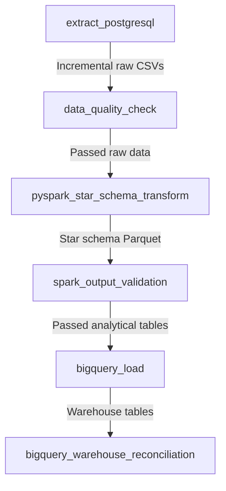

# GlobalScart Data Platform Orchestration with Apache Airflow

This directory contains the Apache Airflow DAGs and plugins for orchestrating the e-commerce transactional data platform from PostgreSQL to Google Cloud BigQuery.

## Pipeline Architecture & DAG Flow

The pipeline is orchestrated as a single DAG named `globalcart_data_engineering_pipeline` with the following linear task dependencies:

### Task Descriptions
1. **`extract_postgresql`** (`BashOperator`):
   * Runs `postgres_extractor.py` inside `.venv` to incrementally query PostgreSQL transactional tables.
   * Leverages watermark state management (`metadata/watermarks/watermarks.json`) to select only records where `updated_at > last_processed_watermark`.
2. **`data_quality_check`** (`BashOperator`):
   * Runs `data_quality.py` to validate extracted raw CSV directories against 18 quality checks (uniqueness, positive limits, null bounds).
3. **`pyspark_star_schema_transform`** (`BashOperator`):
   * Launches a PySpark job (`transform_ecommerce.py`) using Spark session optimization (adaptive execution, local master).
   * Joins dimension tables with transaction order facts to construct the clean, deduplicated, enriched `fact_sales` dataset.
4. **`spark_output_validation`** (`BashOperator`):
   * Executes `spark_validation.py` to automate post-transformation assertions (referential integrity, PK uniqueness, null checks, and financial reconciliation of line items).
5. **`bigquery_load`** (`BashOperator`):
   * Runs `loader.py` using `google-cloud-bigquery` client to load the local Parquet datasets into the dataset `globalcart_analytics` under the GCP project.
6. **`bigquery_warehouse_reconciliation`** (`BashOperator`):
   * Executes `reconciler.py` to connect directly to both PostgreSQL and BigQuery.
   * Compares source and destination row counts, performs duplicate row detection on primary keys, and reconciles total revenues between the source transactional DB and the analytical BigQuery tables (logging results to audit file).

---

## Production Reliability Configuration

The DAG is built with production standards in mind:
* **Watermark Isolation**: The state store preserves watermark timestamps even during pipeline retries, ensuring no transactional history is missed or duplicated.
* **Idempotency**: All processed outputs overwrite previous runs on local tables (`dim_customer`, `dim_product`, `dim_geo`, `dim_date`) or overwrite target files in `fact_sales` partitions, preventing duplication during retry/backfill runs.
* **Retries & Delays**: Failed steps automatic retry up to **1 time** with a **2-minute** delay.
* **Modern Airflow Compliant**: Built specifically to be compatible with **Airflow 3.x** and **Airflow 2.10+** (utilizes the new standard provider import paths and `schedule` parameter syntax).
