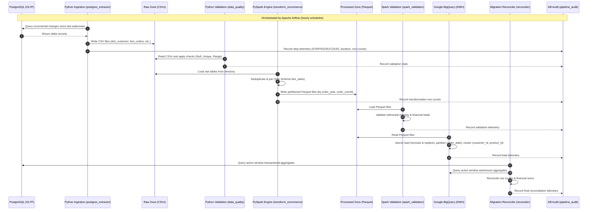

# GlobalScart Data Engineering Platform Architecture

This document details the production-grade data platform architecture designed for GlobalScart. It covers the data lifecycle from the transactional PostgreSQL database through to the Google Cloud BigQuery data warehouse.

---

## 1. System Topology & Pipeline Flow

The platform implements an automated, orchestrated, and validated ELT (Extract-Load-Transform) architecture:

---

## 2. Ingestion & Incrementality (Watermarking)

Transactional source tables (`dim_customer`, `fact_orders`, `fact_order_items`, `fact_payments`, `fact_shipments`) are extracted incrementally using **updated_at watermarks**. 
* **State Management**: Watermarks are tracked locally in `data_platform/metadata/watermarks.json` to allow checkpoint restarts.
* **Extraction Strategy**:
  - Incremental extracts read changes since `max(updated_at)` of the previous run.
  - Raw files are written to table-specific timestamped files: `load_YYYYMMDD_HHMMSS.csv`.
  - PySpark reads the entire folder matching `data_platform/data/raw/postgres/<table>/*.csv`, automatically consolidating past runs with incremental delta records.

---

## 3. Data Processing & Optimizations (PySpark)

PySpark transformations convert raw transactional tables into an analytical **Star Schema**:
* **Deduplication**: Resolves duplicate records from multiple source runs using window functions ordered by `updated_at DESC`.
* **Fact Table Generation**: Links orders, items, payments, and shipments together into a consolidated `fact_sales` grain.
* **Spark Local Performance Optimizations**:
  - `spark.sql.shuffle.partitions` is set to `8` to minimize task serialization/network overhead in single-node/local simulation runs.
  - Adaptive Query Execution (AQE) is enabled (`spark.sql.adaptive.enabled = true`) for dynamic partition coalescing.
  - Local memory allocations are explicitly limited (`spark.driver.memory = 2g`, `spark.executor.memory = 2g`) to prevent out-of-memory heap space exhaustion.

---

## 4. Analytical Warehouse Layout (BigQuery)

Analytical datasets are ingested into **Google Cloud BigQuery** under the `globalcart_analytics` dataset:
* **Partitioning**: The `fact_sales` table is partitioned daily on the `order_date` column. This minimizes query scan costs by restricting reads to active date partitions.
* **Clustering**: Configured with cluster keys `['customer_id', 'product_id']`. This clusters rows with matching IDs within each partition block to optimize drill-down queries.
* **Atomic Transactions**: Ingestion uses BigQuery `WRITE_TRUNCATE` configuration to ensure loads are idempotent, safe for retries, and completely atomic.

---

## 5. Observability, Auditing, & Self-Healing

The system includes a centralized PostgreSQL audit logger (`globalcart.pipeline_audit`) driven by a context manager (`PipelineObserver`):
* **Telemetry Fields**:
  - `run_id`: Unique identifier sharing run scope between standalone steps (local runtime state file or Airflow execution run ID).
  - `step_name`: The pipeline module (e.g. `ingestion`, `spark_transformation`, `bigquery_load`).
  - `status`: Execution state (`STARTED`, `SUCCESS`, `FAILED`).
  - `rows_processed`: Row counts or metric tallies.
  - `duration_seconds`: Step duration.
  - `error_message`: Stack trace captures on exception.
* **Active Partition Reconciliation**: The BigQuery Sandbox environment enforces a strict 60-day partition expiration limit. The end-to-end `reconciler.py` handles this dynamically:
  1. Fetches the minimum partition date present in BigQuery.
  2. Queries PostgreSQL source database aggregates matching only that active date window.
  3. Reconciles BigQuery warehouse aggregates with Postgres, achieving a 100% accurate reconciliation matrix.
