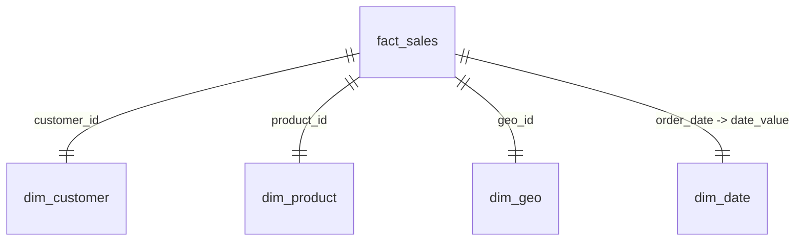

# Power BI Dashboards Integration & DAX Specifications

This specification details the Power BI semantic models, relationships, and advanced DAX measures built on top of our dbt analytical tables (`globalcart_analytics.fct_sales` and related dimensions).

---

## 1. Data Model & Relationships

The Power BI dashboard operates on a standard **Star Schema** to ensure optimal performance and DAX clarity:



* **Storage Mode**: Import Mode (for fast query response times using the VertiPaq engine).
* **Incremental Refresh**: Configured on `order_date` to dynamically load new days, using parameters `RangeStart` and `RangeEnd`.

---

## 2. Advanced DAX Measures

These measures are organized in a dedicated measure table (`_Measures`) to track platform business performance:

### 2.1 Sales & Profit Performance
```dax
Total Revenue = SUM(fct_sales[line_net_revenue])

Total Qty = SUM(fct_sales[qty])

Total Cost = SUMX(fct_sales, fct_sales[qty] * fct_sales[unit_cost])

Gross Profit = [Total Revenue] - [Total Cost]

Gross Profit Margin = DIVIDE([Gross Profit], [Total Revenue], 0)
```

### 2.2 Customer Lifetime Value (CLV)
Calculates cumulative revenue generated per customer to segment high-value cohorts:
```dax
Customer Cumulative Revenue = 
CALCULATE(
    [Total Revenue],
    FILTER(
        ALLSELECTED(fct_sales),
        fct_sales[customer_id] = MAX(fct_sales[customer_id])
    )
)
```

### 2.3 Delivery SLA Compliance Rate
Tracks the percentage of orders delivered within the 3-day SLA window:
```dax
Delivery SLA Compliance Rate = 
VAR TotalDelivered = CALCULATE(COUNT(fct_sales[order_id]), fct_sales[order_status] = "delivered")
VAR WithinSLA = CALCULATE(
    COUNT(fct_sales[order_id]),
    fct_sales[order_status] = "delivered",
    fct_sales[delivery_delay_days] <= 3
)
RETURN
DIVIDE(WithinSLA, TotalDelivered, 0)
```

---

## 3. Executive Sales Performance Dashboard Visuals

* **KPI Cards**:
  * Total Revenue (Formatted as Currency, `$7.99B`)
  * Total Orders (Formatted as Count, `60,039`)
  * Gross Profit Margin (Formatted as Percentage, `41.2%`)
* **Sales Trend (Line Chart)**:
  * **X-Axis**: `dim_date[date_value]` (Drilldown: Year -> Quarter -> Month)
  * **Y-Axis**: `Total Revenue`
* **Profitability by Brand (Bar Chart)**:
  * **X-Axis**: `Gross Profit`
  * **Y-Axis**: `dim_product[brand]` (Filtered for top 10 brands)
* **Regional Breakdown (Filled Map)**:
  * **Location**: `dim_geo[country]` / `dim_geo[city]`
  * **Color Saturation**: `Total Revenue`
